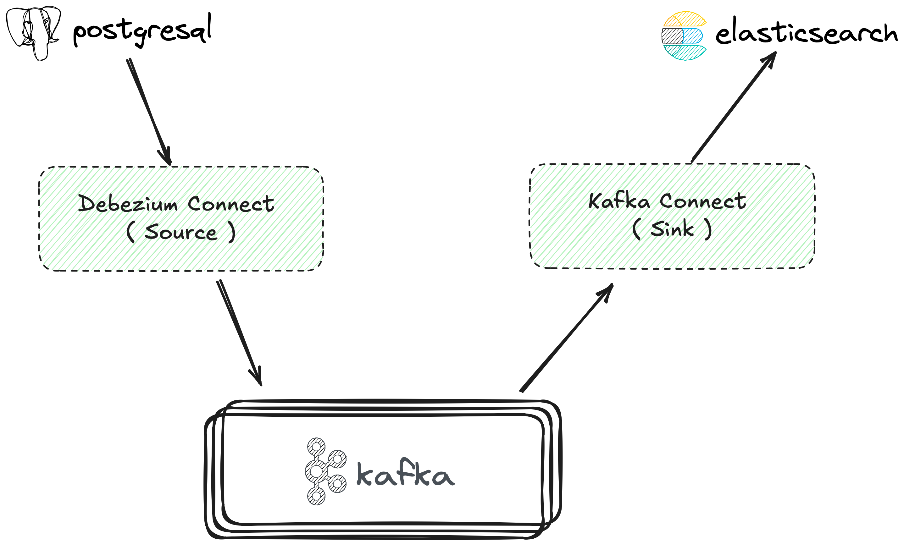

# Capture Data Change (CDC): Postgres Data to Elasticsearch

> Powered by Debezium and Kafka Connect

<div align="center">

[📖 中文](README.zh.md) | [📖 English](README.md)

</div>

---

## Table of Contents

- [Why This Project](#why-this-project)
- [System Architecture](#system-architecture)
- [How to Download](#how-to-download)
- [How to Use](#how-to-use)
- [Pitfalls](#pitfalls)

---

## Why This Project

To be honest, the need for CDC has been around for a long time. Back when I built [Gimy Clone, a video streaming platform](https://github.com/weiawesome/gimy_clone_api), I wanted to improve search functionality for users. I implemented Elasticsearch for searching, but used dual-write and didn't handle errors at all.

Later, during my military service, I read quite a few books introducing related concepts, including ETL and others.

After the army, it got even more interesting: I joined a company specializing in CDC and turning it into an enterprise-grade product (of course, they wrote their own programs instead of using Debezium and Kafka Connect directly). Apparently, CDC has always been close to me.

Recently, I started another software project and realized a search engine could come in handy again (this time, I could integrate CDC technology, haha).

With [Wes IO Live, the livestreaming platform](https://github.com/weiawesome/wes-io-live), I decided to try out the well-known Debezium and Kafka Connect for CDC.

---

## System Architecture



---

## How to Download

### 1. Clone the Project

```bash
git clone https://github.com/weiawesome/debezium-postgres-elasticsearch-cdc.git
```

### 2. Enter the Project Directory

```bash
cd debezium-postgres-elasticsearch-cdc
```

---

## How to Use

### Phase 1: Environment Setup

#### Step 1: Start the Core Services

Use `docker-compose` to start postgres, elasticsearch, and kafka:

```bash
docker-compose up -d postgres elasticsearch kafka
```

#### Step 2: Add a Table and Insert Data in Postgres

```bash
# Use the script (the script will use docker exec to run psql commands)
bash ./scripts/02-insert-data.sh
```

---

### Phase 2: Postgres → Kafka (Debezium CDC)

#### Step 3: Create Required Topics for connect-debezium

As specified in the environment variables of the connect-debezium service in `docker-compose.yaml`:

```bash
docker exec -it kafka kafka-topics --bootstrap-server kafka:9092 \
  --create --topic connect-configs-debezium \
  --partitions 1 --replication-factor 1 \
  --config cleanup.policy=compact

docker exec -it kafka kafka-topics --bootstrap-server kafka:9092 \
  --create --topic connect-offsets-debezium \
  --partitions 1 --replication-factor 1 \
  --config cleanup.policy=compact

docker exec -it kafka kafka-topics --bootstrap-server kafka:9092 \
  --create --topic connect-status-debezium \
  --partitions 1 --replication-factor 1 \
  --config cleanup.policy=compact
```

#### Step 4: Start connect-debezium

```bash
docker-compose up -d connect-debezium
```

#### Step 5: Add Connector (Postgres → Kafka)

```bash
curl -X POST -H "Content-Type: application/json" http://localhost:8083/connectors -d @./configs/connector.json
```

#### Step 6: Check Connector Status

```bash
# List connectors
curl http://localhost:8083/connectors | jq

# Check connector status
curl http://localhost:8083/connectors/cdc-connector | jq

# Check detailed connector status
curl http://localhost:8083/connectors/cdc-connector/status | jq
```

#### Step 7: Verify Kafka Data

```bash
# List topics
docker exec -it kafka kafka-topics --bootstrap-server localhost:9092 --list

# Consume messages from the Kafka topic
docker exec -it kafka kafka-console-consumer --bootstrap-server localhost:9092 --topic cdc-public-users --from-beginning
# Use ctrl + c to stop consuming and check the count
```

#### Step 8: Insert New Data and Verify CDC Operation

```bash
# Insert new data
bash ./scripts/02-insert-data.sh

# List topics
docker exec -it kafka kafka-topics --bootstrap-server localhost:9092 --list

# Consume messages from the Kafka topic (you should see the newly inserted data)
docker exec -it kafka kafka-console-consumer --bootstrap-server localhost:9092 --topic cdc-public-users --from-beginning
# Use ctrl + c to stop consuming and check the count
```

---

### Phase 3: Kafka → Elasticsearch

#### Step 9: Create Required Topics for connect-kafka-es

As specified in the environment variables of connect-kafka-es in `docker-compose.yaml`:

```bash
docker exec -it kafka kafka-topics --bootstrap-server kafka:9092 \
  --create --topic connect-configs-kafka-es \
  --partitions 1 --replication-factor 1 \
  --config cleanup.policy=compact

docker exec -it kafka kafka-topics --bootstrap-server kafka:9092 \
  --create --topic connect-offsets-kafka-es \
  --partitions 1 --replication-factor 1 \
  --config cleanup.policy=compact

docker exec -it kafka kafka-topics --bootstrap-server kafka:9092 \
  --create --topic connect-status-kafka-es \
  --partitions 1 --replication-factor 1 \
  --config cleanup.policy=compact
```

#### Step 10: Start connect-kafka-es

```bash
docker-compose up -d connect-kafka-es
```

#### Step 11: Create DLQ Topic

Set according to `errors.deadletterqueue.topic.name` in `./configs/sink.json`:

```bash
docker exec -it kafka kafka-topics --bootstrap-server kafka:9092 \
  --create --topic dlq-elasticsearch \
  --partitions 1 --replication-factor 1 \
  --config cleanup.policy=compact
```

#### Step 12: Add Connector (Kafka → Elasticsearch)

```bash
curl -X POST -H "Content-Type: application/json" http://localhost:8085/connectors -d @./configs/sink.json
```

#### Step 13: Check Connector Status

```bash
# List connectors
curl http://localhost:8085/connectors | jq

# Check connector status
curl http://localhost:8085/connectors/postgres-es-sink | jq

# Check detailed connector status
curl http://localhost:8085/connectors/postgres-es-sink/status | jq
```

#### Step 14: Check Elasticsearch Data

```bash
curl "http://localhost:9200/cdc-public-users/_search" | jq
```

#### Step 15: Insert New Data and Verify End-to-End Sync

```bash
# Insert new data
bash ./scripts/02-insert-data.sh

# Check Elasticsearch data count (you should see the newly inserted data)
curl "http://localhost:9200/cdc-public-users/_search" | jq
```

---

## Pitfalls

> Painful lessons

Only after carefully reading the [Elasticsearch Sink Connector](https://docs.confluent.io/kafka-connectors/elasticsearch/current/overview.html) documentation did I realize it only officially supports v7 and v8, not v9. I kept running into errors and was clueless about the cause—only to finally, accidentally, discover a version incompatibility. Almost drove me insane.
